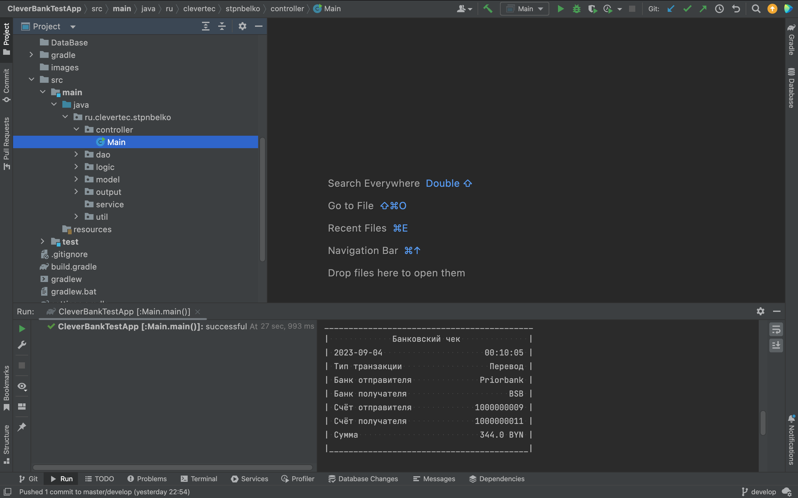
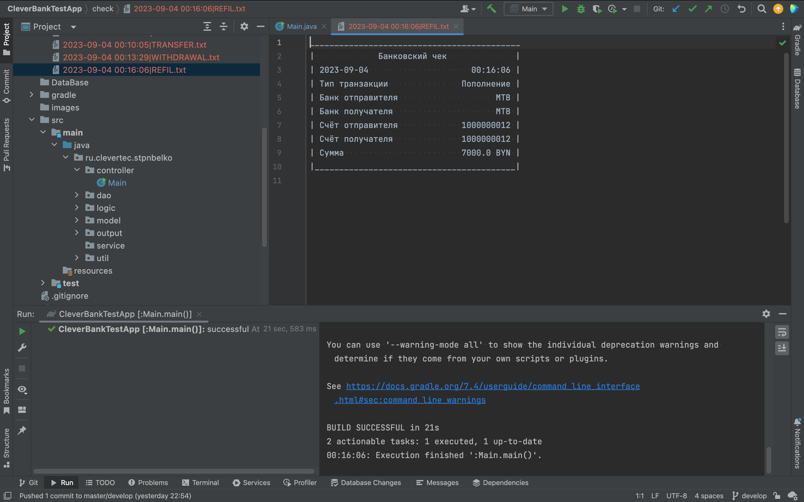
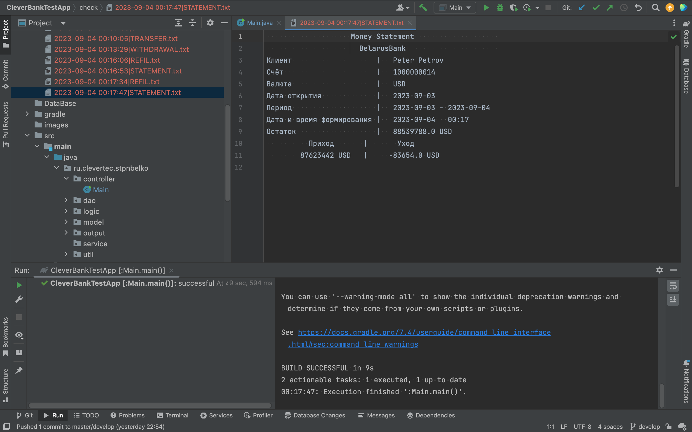
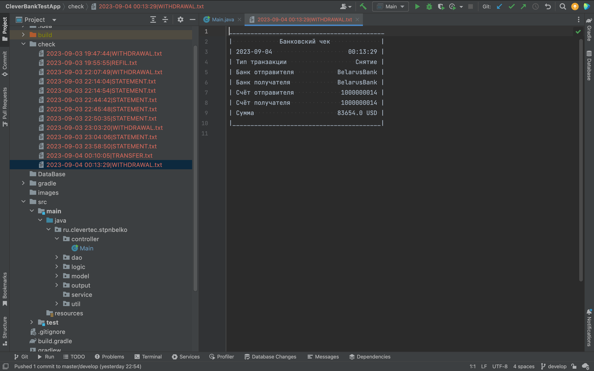

# CleverBankTestApp
Первая рабочая версия приложения ClevertecBank.

Функционал:
1. Перевод средств
2. Снятие средств
3. Пополнение баланса
4. Выписка за весь период

Запуск:

1. Прежде чем запустить приложение нужно выполнить скрипт CleverBankDB.sql, который лежит в папке DataBase в корне проекта, чтобы запустить корректную работу базы данных PostgreSQL
2. Входной точкой явдяется метод main в src/main/java/ru/clevertec/stpnbelko/controller/Main.java
3. После запуска выбираем id пользователя от которого хотим совершить операцию.
4. Выбираем операцию.
5. При переводе средств требуется ввести 10-значный номер счёта получателя (Например 1000000009 или 1000000012)
6. Чеки всех операций хранятся в папке Check в корне проекта и дублируются в консоль.
7. Вся информация о выполненных операциях так же сохраняется в базу танных.

В данной версии приложения полностью отсутствует защита от ввода некорректных данных, поэтому при вводе будьте внимательнее)

Приложение разрабатывалось и тестировалось на macOS Big Sur версии 11.7.9

